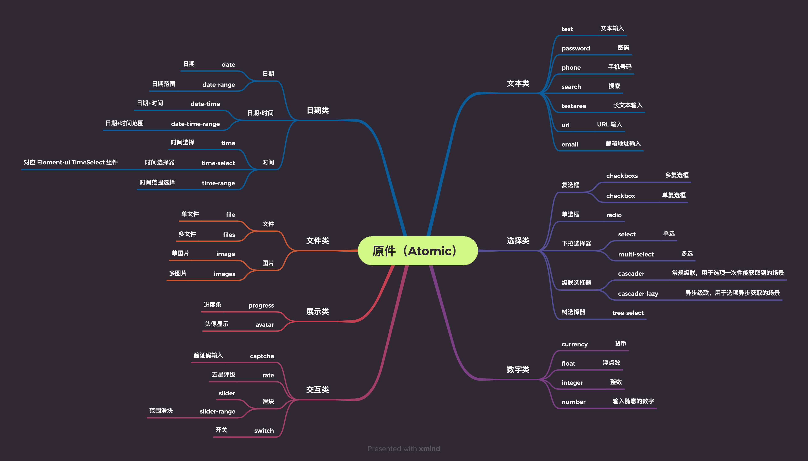
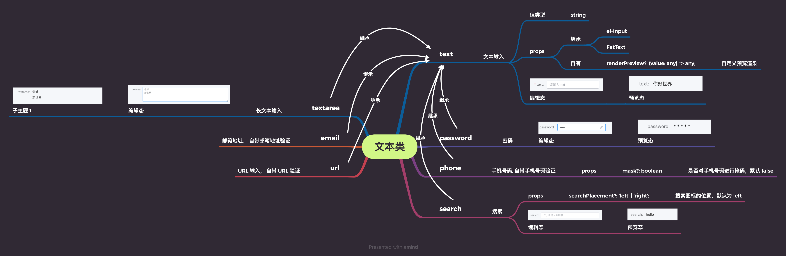
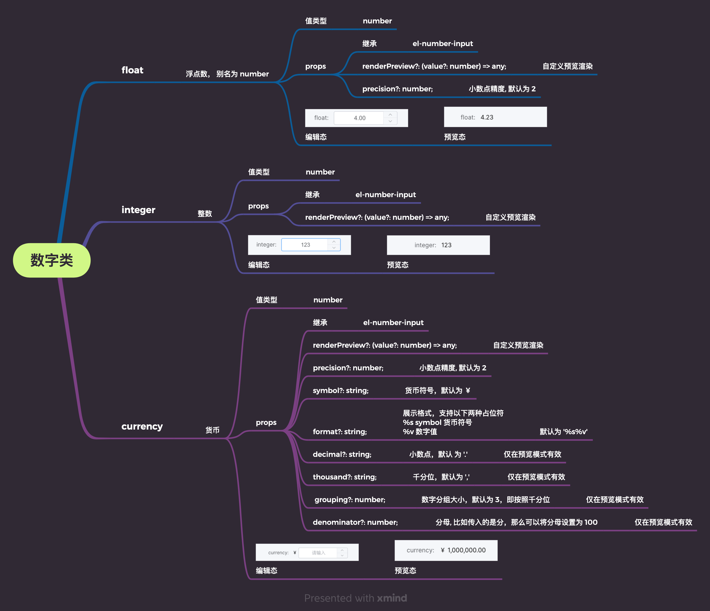
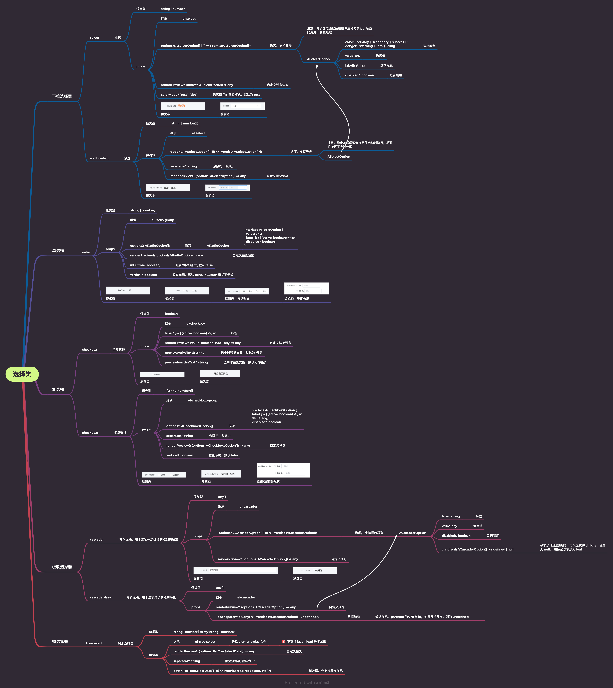
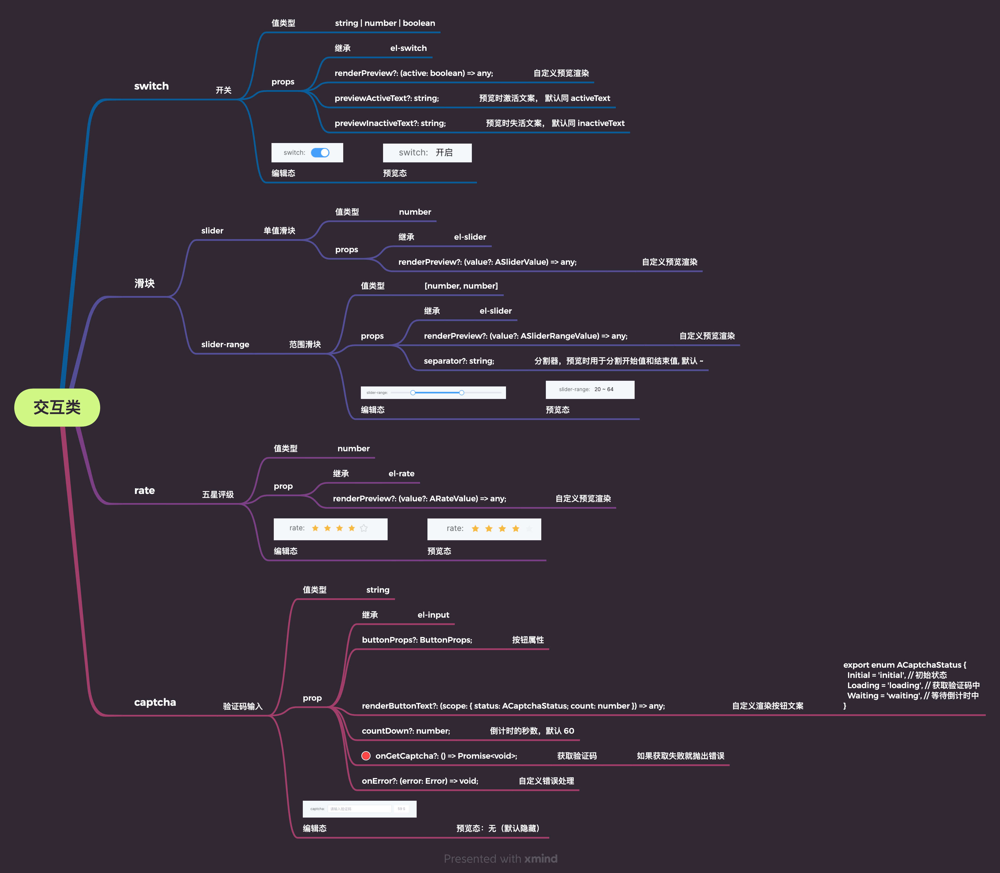
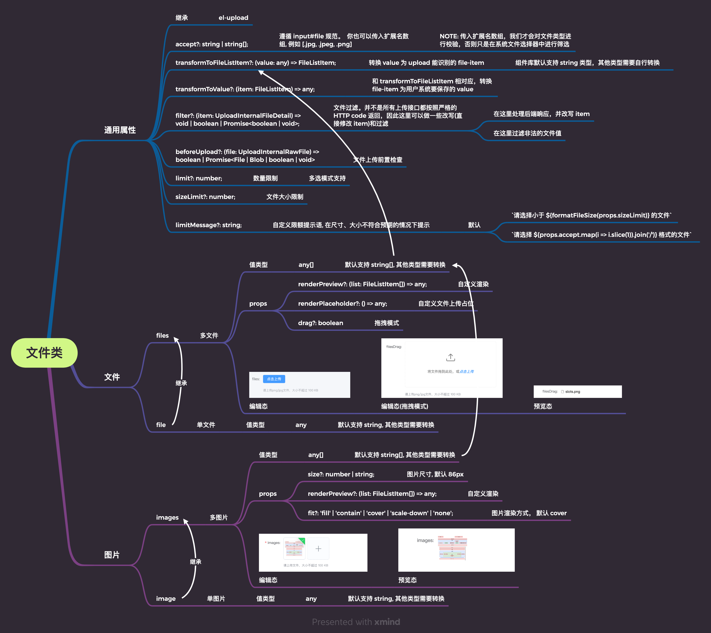
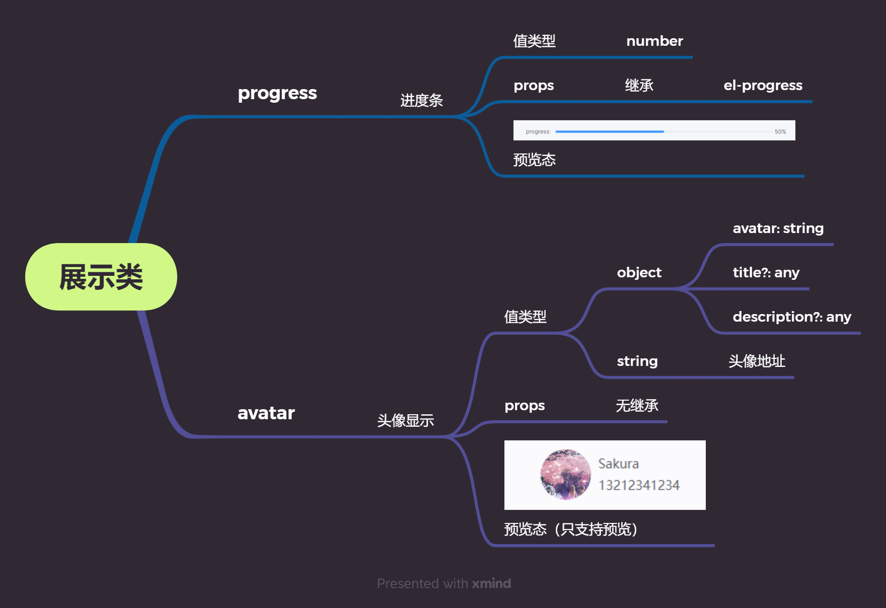

# 原件

 
 

根据过往的项目经验，我们的组件库内置了较多最为常用的组件, 如下图所示。 如果你有需求，也可以[提交给我们](https://wakedata.notion.site/304a4d27483e4bef980c03642438565b), 我们会根据通用性评估，决定是否要内置到组件库中。

 

 
 

::: warning

注意：原件基于 [`element-ui`](https://element.eleme.cn) 或 [`element-plus`](https://element-plus.gitee.io/), 某些组件的参数在两个库中有些区别。 `@wakeadmin/components` 不会抹平这块的差异

:::

 
 
 

## 示例

<iframe class="demo-frame" style="height: 900px" src="./all-atomics.demo.html" />

::: details 查看代码
<<< @/atomics/AllAtomics.vue
:::

 
 
 
 

## API

### 文本类

 

 
 
 

### 数字类

 
 
 
 

### 选择类

 
 
 
 

### 交互类

 
 
 
 

### 文件类

 
 
 
 

### 日期类

 
 
 
 

### 展示类

 
 
 
 
