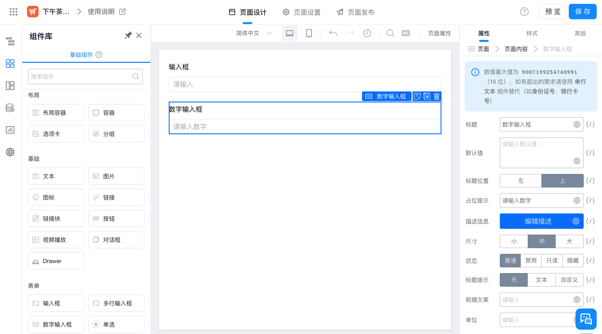

# 基本概念

## 何为 'fat'

Fat 是肥胖的意思。`@wakeadmin/components` 的定位是一个高级组件库，而不是 element-ui 这类基础组件库。它的目标是覆盖管理后台的 80% 的开发场景，因此，它有以下特征：

- 组件的粒度更加大。大到一个页面，小到一个页面区域。
- 遵循“约定大于配置”。 我们期望开发一个页面，只需要少量的配置代码，按照 UI/产品 规范，将大部分交互、数据处理的细节固定下来，做到开箱即用。

 
 
 

## 何为'原件(Atomic)'

原件类似于低代码平台的’组件‘，在 `@wakeadmin/components` 中，`原件` 是组成`表格` 和`表单`的基本单位。

原件有两种形态：

- `编辑形态(editable)`: 用于表单、表格查询等场景
- `预览形态(preview)`: 用于详情页，表格等场景

 
 

代码示例：

<ClientOnly>
  <Atomics />
</ClientOnly>

::: details 查看代码

<<< @/base/Atomics.vue

:::
