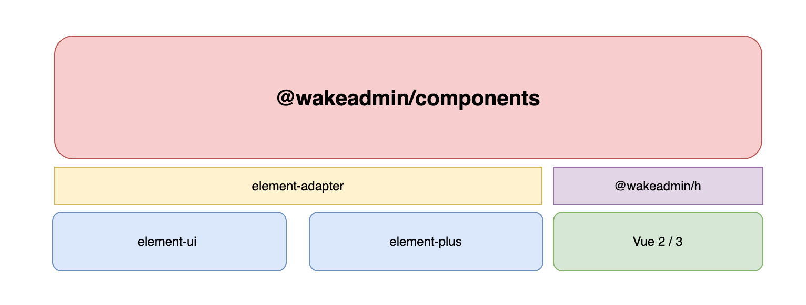
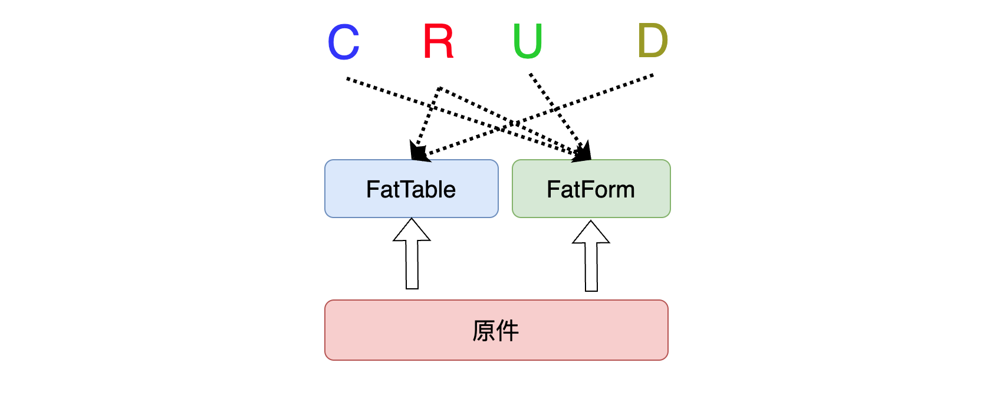

# 开始

<br>

[[toc]]

<br>
<br>
<br>
<br>

`@wakeadmin/components` 是基于 Vue 和 `Element-UI`/`Element-plus` 的高级组件库。旨在解放管理后台端 CRUD 页面的前端生产力。

<br>
<br>
<br>

## 整体架构



<br>

- `element-adapter`: 这里主要用于封装 element-ui/element-plus 之间的一些差异。 `@wakeadmin/components` 不会直接依赖 element-ui/element-plus, 而是使用 element-adapter 暴露的统一 API
- `@wakeadmin/h`/`@wakeadmin/demi`: 这是一个 JSX 库，屏蔽了 Vue 2/3 在视图渲染上的一些差异，从而让 `@wakeadmin/components` 兼容 Vue 2/3。

<br>
<br>
<br>

**主要内容：**



<br>

`@wakeadmin/components` 包含三大核心部件：

- `FatTable`: 用于常见的列表、表格查询页面
- `FatForm`: 用于常见的创建表单、更新表单、表单详情等页面
- `原件(Atomics)`: 原件是组成 FatTable、FatForm 的基本单位，为不同**数据类型**定义*编辑*和*预览*的视图。

<br>
<br>
<br>
<br>

## Prerequisites

<br>
<br>

`@wakeadmin/components` 支持 Vue 2/3:

- **Vue 2**: 要求 **Vue 2.7.13+**, element-ui 2.14+
- **Vue 3**: Vue 3.0+, element-plus 2.2+

<br>

::: warning
注意，Vue 2 下，仅支持 2.7.13+，请升级到最新的 Vue 2 版本。并移除旧的 `@vue/composition-api`
:::

<br>
<br>
<br>
<br>

## 安装

<br>

```shell
$ pnpm add @wakeadmin/components
```

<br>
<br>

**开发依赖**:

如果你想要使用 `TSX`/`JSX` 开发，并且获取到更好的 `Typescript` 类型检查，需要安装以下依赖:

<br>

```shell
$ pnpm add babel-preset-wakeadmin @wakeadmin/h @wakeadmin/demi vue-tsc -D

# 升级 @wakeadmin/* 相关依赖到最新版本
$ pnpm up -r -L \"@wakeadmin/*\"
```

::: warning 建议将 @wakeadmin/\* 相关库都升级到最新版本
:::

:::tip 如果你使用的是 vue-cli，建议在 vue.config.js 中加入以下配置:

```js
// ...
module.exports = defineConfig({
  // 构建时转换 @wakeadmin/* 相关库，让 babel 参与转译，以符合你的兼容性需求
  transpileDependencies: process.env.NODE_ENV === 'production' ? [/(wakeapp|wakeadmin)/] : false,
  // ...
});
```

:::

<br>
<br>
<br>
<br>

## 更好的 Typescript 支持

首先根据你使用的构建工具，配置相关的 Typescript 构建支持：

- Vue CLI: 安装 [`@vue/cli-plugin-typescript`](https://cli.vuejs.org/core-plugins/typescript.html)
- Vite: [内置支持转换](https://vitejs.dev/guide/features.html#typescript)

<br>
<br>
<br>

**IDE** 上推荐使用 [`Valor`](https://github.com/johnsoncodehk/volar) 插件，并禁用掉 `Vetur` 插件。在 VSCode 中, 你可以安装一下两个插件:

<br>

- [Vue Language Features](https://marketplace.visualstudio.com/items?itemName=Vue.volar): Vue, Vitepress, petite-vue language support extension for VSCode
- [TypeScript Vue Plugin ](https://marketplace.visualstudio.com/items?itemName=Vue.vscode-typescript-vue-plugin) VSCode extension to support Vue in TS server

<br>
<br>
<br>
<br>

接着配置 tsconfig.json:

```json
{
  "compilerOptions": {
    "types": ["@wakeadmin/demi"]
  },
  "vueCompilerOptions": {
    "target": 2.7
  }
}
```

<br>
<br>
<br>

接着，配置一个 `src/env.d.ts`(旧的项目可能已存在, 比如 vue-cli, `shims-tsx.d.ts`、`shims-vue.d.ts`, 将这些文件删掉) 文件，让 TypeScript **标准**的类型检查器可以识别 `*.vue` 文件:

```ts
// env.d.ts
// 你可能把旧的 declare module '*.vue' 移除
declare module '*.vue' {
  import type { DefineComponent } from 'vue';
  const component: DefineComponent<{}, {}, any>;
  export default component;
}
```

::: tip _`.vue` 文件, 像 `.css` 这些静态资源文件一样, 标准的 Typescript 是无法识别里面的类型的_, 当然装了 Volar 插件之后, Valor 可以做到。但是仅在 IDE 层面，如果你想要在构建时/CI 时进行类型检查，可以用 [vue-tsc](https://github.com/johnsoncodehk/volar/tree/master/vue-language-tools/vue-tsc)
:::

<br>

::: danger 💥 如果使用了 `@vue/cli-plugin-typescript` 插件，请关闭掉 [`fork-ts-checker-webpack-plugin`](https://github.com/TypeStrong/fork-ts-checker-webpack-plugin/tree/6.5.x):

编辑 `package.json`:

```json
{
  "fork-ts-checker": {
    "typescript": false
  }
}
```

<br>
<br>

为什么不使用它？ [Vue 官方也不推荐使用它](https://vuejs.org/guide/typescript/overview.html#note-on-vue-cli-and-ts-loader)。一个比较重要的问题是，它的执行结果未必和 IDE 一致，异常也很难排查。

:::

<br>

最后，如果想要对类型进行检查，推荐使用 [`vue-tsc`](https://github.com/johnsoncodehk/volar/tree/master/vue-language-tools/vue-tsc):

```json
// package.json
{
  "scripts": {
    "prebuild": "vue-tsc --noEmit"
  }
}
```

如果使用了惟客云[自动化检查工具](https://wakedata.notion.site/d223981cad664edab0c89fd269aa751d), 可以这样配置：

```json
// .standard.jsonc
{
  // 执行 Typescript 类型检查
  "typescriptEnable": true,

  // typescript 检查命令
  "typescriptCmd": "vue-tsc --noEmit"
}
```

<br>
<br>
<br>
<br>

## 更好的 JSX 支持

大部分场景，我们推荐你使用 Vue 的 [SFC](https://vuejs.org/guide/scaling-up/sfc.html) + [setup + TypeScript](https://vuejs.org/guide/typescript/composition-api.html#typing-component-props) 来编写组件。

<br>

然而，在你们使用 `@wakeadmin/components` 时，为了灵活定义组件库，你会经常用到 JSX。

<br>

假设你的项目使用是 Vue-cli, 第一步先修改 `babel.config.js`

```js
module.exports = {
  // 关闭 vue 默认的 jsx 转换， 统一使用标准的 JSX
  presets: [['@vue/cli-plugin-babel/preset', { jsx: false }], 'babel-preset-wakeadmin'],
};
```

<br>
<br>

接着修改 `tsconfig.json` 配置:

```json{3,4}
{
  "compilerOptions": {
    "jsx": "react-jsx",
    "jsxImportSource": "@wakeadmin/h",
    "types": ["@wakeadmin/demi"],
  },
}

```

<br>
<br>
<br>

这里，我们使用 [`@wakeadmin/h`](https://wakeadmin.wakedata.com/base/h.html) 来编写 JSX。好处是：

<br>

1. **不管你用的是 Vue 2, 还是 Vue 3, 使用 `@wakeadmin/h` 可以提供一致的编写方式**, 更接近我们在 React 上的使用习惯。

   - Vue 2 / 3 JSX 书写上[相差非常大](https://www.notion.so/Vue-2-3-302cbe0e37794345bbfbd89e32d617db)
   - Vue 官方的 JSX 库携带了很多语法糖。这依赖于 Babel 的转换，这意味着你无法直接使用 esbuild、Typescript 这类工具进行编译。

2. 除此之外，`@wakeadmin/h` 也优化了 Vue JSX 在 Typescript 支持上的一些问题。

<br>
<br>

使用示例：

```jsx
<div onClick={handleClick} class="hello" />; // 使用 on* 的语法进行事件监听
<div onClick={handleClick} class={[hello, { active: isActive }]} style={{ color: 'red' }} />;

// 插槽的使用，使用 v-slots
<Tooltip v-slots={{ content: <div>hello</div>, named: scope => <div>命名插槽</div> }}>
  <span class="fat-actions__btn">{content}</span>
</Tooltip>;

// 指令：https://vuejs.org/api/render-function.html#withdirectives
<div {...withDirectives([[vLoading, loading.value]])}>加载中</div>;
```

<br>
<br>
<br>
<br>

::: danger 如果你要在 Vue SPA 中使用 TS + JSX， Eslint 可能会报错，你需要以下配置：

```js{4-10}
// 支持 .vue 文件中 包含 jsx
const ts = require('typescript');

const { ensureScriptKind } = ts;
ts.ensureScriptKind = function (fileName, ...args) {
  if (fileName.endsWith('.vue')) {
    return ts.ScriptKind.TSX;
  }
  return ensureScriptKind.call(this, fileName, ...args);
};

module.exports = {
  extends: ['wkts', 'wkvue', 'plugin:jest/recommended'],
  plugins: [],
  globals: {},
  rules: {},
  parser: 'vue-eslint-parser',
  parserOptions: {
    parser: '@typescript-eslint/parser',
    project: 'tsconfig.json',
    sourceType: 'module',
    ecmaVersion: 'latest',
    extraFileExtensions: ['.vue'],
  },
  env: {
    browser: true,
    es2020: true,
  },
  overrides: [
    {
      files: ['*.ts', '*.tsx'],
      rules: {},
      parser: '@typescript-eslint/parser',
      parserOptions: {
        warnOnUnsupportedTypeScriptVersion: true,
        ecmaVersion: 'latest',
        lib: ['esNext'],
        project: './tsconfig.json',
      },
    },
  ],
};
```

:::

<br>
<br>
<br>
<br>

## 初始化

引入样式，并安装 Vue 插件:

```tsx
import Vue from 'vue';
import { plugin } from '@wakeadmin/components';

// 引入样式
import '@wakeadmin/components/style/index.scss';

// vue 2.x 用法
Vue.use(plugin);
```

<br>
<br>
<br>

::: tip 如果你使用 element-plus, 且使用了[自定义命名空间](https://element-plus.gitee.io/zh-CN/guide/namespace.html)
`@wakeadmin/components` 定制了部分 element 组件的样式，因此如果你使用自定义命名空间，在导入 @wakeadmin/components 的样式时，同样需要配置一下命名空间变量:

创建一个 新的 scss 文件，或者在`应用根组件` 的 `<style lang="scss">` 中添加以下代码:

```vue
<template>
  <el-config-provider namespace="ep">
    <div id="app">
      <router-view />
    </div>
  </el-config-provider>
</template>

<script lang="ts" setup></script>

<style lang="scss">
  // 自定义命名空间
  @forward 'element-plus/theme-chalk/src/mixins/config.scss' with (
    $namespace: 'ep'
  );

  @use 'element-plus/theme-chalk/src/index.scss' as *;

  // 定义 @wakeadmin/components 下的 element-ui 命名空间
  @forward '@wakeadmin/components/style/_config.scss' with (
    $el-ns: 'ep'
  );

  @use '@wakeadmin/components/style/index.scss' as *;

  body {
    margin: 0;
    padding: 0;
  }
</style>
```

:::

<br>
<br>
<br>
<br>

## 开启编程之旅

<br>
<br>
<br>
<br>

开发一个简单的表格：

```tsx
import { defineFatTable } from '@wakeadmin/components';

/**
 * 表格项类型
 */
export interface Item {
  id: number;
  name: string;
  createDate: number;
}

export const MyTable = defineFatTable<Item>(({ column }) => {
  return () => ({
    // 表格数据获取
    async request(params) {
      const { pagination, query } = params;

      const { data: list, total } = await getMyList({ ...query, ...pagination });

      return {
        total,
        list,
      };
    },
    // 删除操作
    async remove(list, ids) {
      await removeItem(ids);
    },
    // 表格列
    columns: [
      // queryable 标记为查询字段
      column({ prop: 'name', label: '名称', queryable: true }),
      column({ prop: 'createDate', valueType: 'date-range', label: '创建时间', queryable: true }),
      column({
        type: 'actions',
        actions: (table, row) => [{ name: '编辑' }, { name: '删除', onClick: () => table.remove(row) }],
      }),
    ],
  });
});
```
