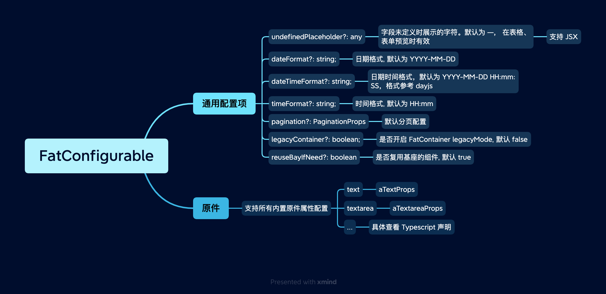

# FatConfigurable 约定大于配置

我们的组件库秉承 “约定大于配置” 的原则，主导开箱即用。即使需要定制，我们也建议在全局将这些配置固化下来，形成规范，在应用范围内保持统一。

<br>
<br>

## 配置

配置有两种方式：

### 1. FatConfigurableProvider 组件

```vue
<template>
  <FatConfigurableProvider :value="config">
    <router-view></router-view>
  </FatConfigurableProvider>
</template>

<script setup>
  import { FatConfigurableProvider } from '@wakeadmin/components';

  const config = {
    /*...*/
  }; // 也支持 ref， computed. 比如你需要支持 多语言
</script>
```

<br>
<br>
<br>

### 2. provideFatConfigurable() Composition API

```vue
<script setup>
  import { provideFatConfigurable } from '@wakeadmin/components';

  const config = {
    /*...*/
  }; // 也支持 ref， computed. 比如你需要支持 多语言

  provideFatConfigurable(config);
</script>
```

<br>
<br>
<br>
<br>

## 示例

```ts
import { provideFatConfigurable } from '@wakeadmin/components';
import { Message } from 'element-ui';

export function injectFatConfigurations() {
  provideFatConfigurable({
    // 统一处理 images 原件上传
    aImagesProps: {
      action: '/permission/web/permission/sso/client/upload',
      // 从
      filter: item => {
        if (item.response) {
          if (!item.response.success) {
            const message = item.response.msg ?? item.response.errorMessage;
            Message.error(message);

            throw new Error(message);
          }

          item.url = item.response.data.url;
        }
      },
    },
    // 统一 date-range 原件属性
    aDateRangeProps: {
      rangeSeparator: '至',
      startPlaceholder: '开始日期',
      endPlaceholder: '结束日期',
      valueFormat: 'yyyy-MM-dd',
      shortcuts: [
        {
          text: '最近一周',
          onClick(picker: any) {
            picker.$emit('pick', getTime(7));
          },
        },
        {
          text: '最近一个月',
          onClick(picker: any) {
            picker.$emit('pick', getTime(30));
          },
        },
        {
          text: '最近三个月',
          onClick(picker: any) {
            picker.$emit('pick', getTime(90));
          },
        },
      ],
    },
  });
}
```

<br>
<br>
<br>

## 配置项

FatConfigurable 支持一些通用配置项，以及所有[内置原件](../atomics/index.md)的 props 配置。

<br>



<br>
<br>
<br>
