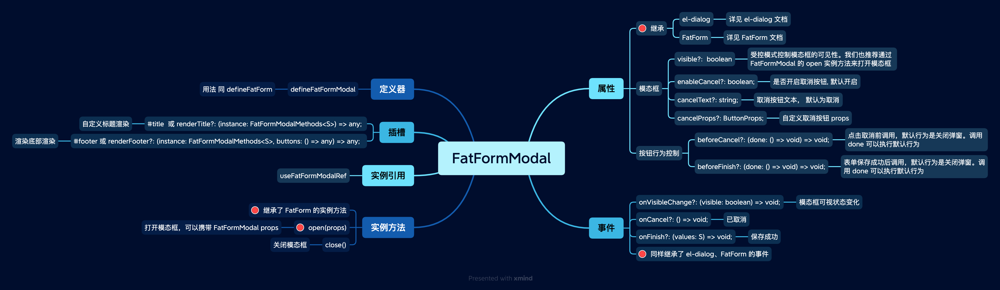

# FatFormModal 表单模态框

`FatFormModal` 是 FatForm 针对 模态框场景设计的一个组件。适用于弹窗式的表单创建、编辑需求。

 
 

## 示例

<ClientOnly>
  
<Modal />

</ClientOnly>

::: details 查看代码
<<< @/fat-form-layout/Modal.vue
:::

 
 
 
 

## API

 
 
 
