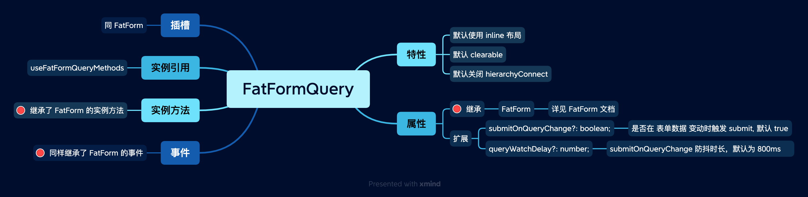

# FatFormQuery 查询 (beta)

`FatFormQuery` 是 FatForm 针对查询表单场景设计的一个组件。 [FatTable](../fat-table/index.md) 内部就使用了 FatFormQuery。

 
 
 

## 示例

<ClientOnly>
  
<Query />

</ClientOnly>

::: details 查看代码
<<< @/fat-form-layout/Query.vue
:::

默认情况下，fat-form-query 会对提交按钮和标签进行对齐，以起到美观的效果。

 

你也可以通过显式配置 `labelWidth`（获取[全局配置](../fat-configurable/index.md)#fatFormQuery） 关闭掉:

<ClientOnly>
  
<QueryNonAlign />

</ClientOnly>

::: details 查看代码
<<< @/fat-form-layout/QueryNonAlign.vue
:::

 
 
 

## API

 

 
 
 
