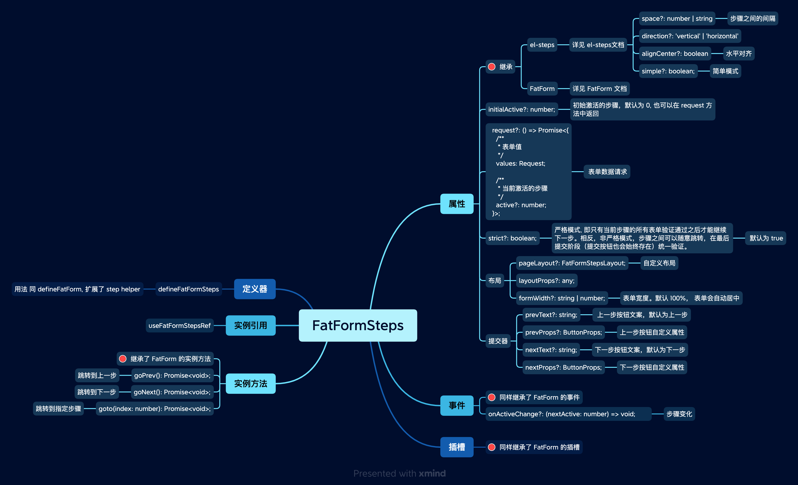
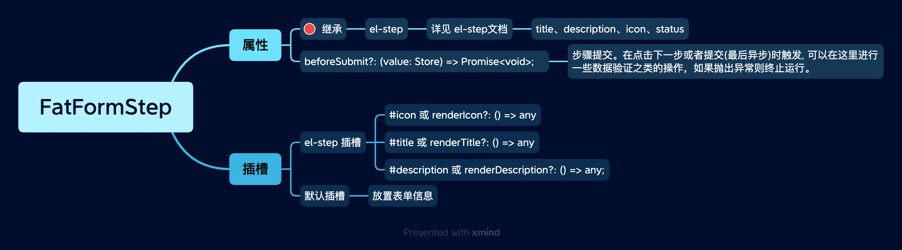

# FatFormSteps 分步表单

`FatFormSteps` 是 FatForm 针对复杂表单分步的场景设计的一个组件。

## 示例

使用组件模式创建:

<iframe class="demo-frame" style="height: 380px" src="./steps.demo.html" />

::: details 查看代码

<<< @/fat-form-layout/Steps.vue

:::

 
 
 
 

(推荐)使用 `defineFatFormSteps` 模式创建:

<iframe class="demo-frame" style="height: 380px" src="./steps-define.demo.html" />

::: details 查看代码

<<< @/fat-form-layout/Steps.tsx

:::

 
 
 

复杂表单可以使用 `FatFormSection` 进一步分类：

<iframe class="demo-frame" style="height: 620px" src="./steps-complex.demo.html" />

::: details 查看代码

<<< @/fat-form-layout/Steps-Complex.tsx

:::

 
 
 

垂直布局:

<iframe class="demo-frame" style="height: 620px" src="./steps-complex-vertical.demo.html" />

::: details 查看代码

<<< @/fat-form-layout/Steps-Complex-Vertical.tsx

:::

 
 
 
 

## API

`FatFormSteps`:

 
 
 

`FatFormStep`:

 
 
 
 
