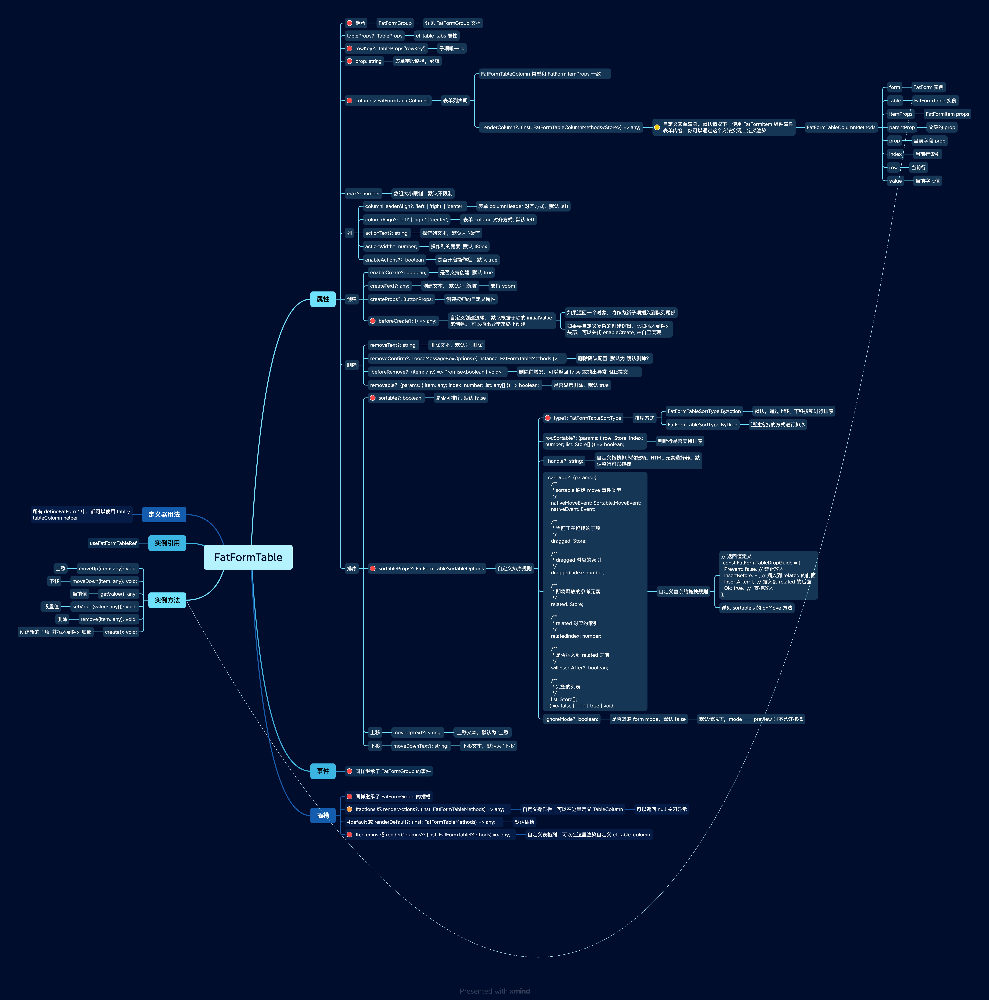

# FatFormTable 表格表单

`FatFormTable` 以表格的形式来展现数组表单。

 
 

## 示例

### 简单示例

 

<iframe class="demo-frame" style="height: 500px" src="./table.demo.html" />

::: details 查看代码

<<< @/fat-form-layout/Table.tsx

:::

::: warning element-ui 先建议显式设置 table 的宽度，避免溢出
:::

::: warning 表单验证规则建议设置在 tableColumn 上，而不是 table 或者 form 上。因为数组项的 prop 是动态的
:::

 
 
 
 

自定义表单项创建逻辑:

<iframe class="demo-frame" style="height: 500px" src="./table-custom-create.demo.html" />

::: details 查看代码

<<< @/fat-form-layout/TableCustomCreate.tsx

:::

 
 
 
 

### 表格排序

通过 `上移`、 `下移` 操作项进行排序：

<iframe class="demo-frame" style="height: 500px" src="./table-sortable-simple.demo.html" />

::: details 查看代码

<<< @/fat-form-layout/TableSortableSimple.tsx

:::

 
 
 
 
 
使用拖拽进行排序:

<iframe class="demo-frame" style="height: 700px" src="./table-sortable-drag.demo.html" />

::: details 查看代码

<<< @/fat-form-layout/TableSortableDrag.tsx

:::

 
 
 
 

复杂的排序规则，自定义拖拽的把柄：

<iframe class="demo-frame" style="height: 700px" src="./table-sortable.demo.html" />

::: details 查看代码

<<< @/fat-form-layout/TableSortable.tsx

:::

 
 
 
 

## API

