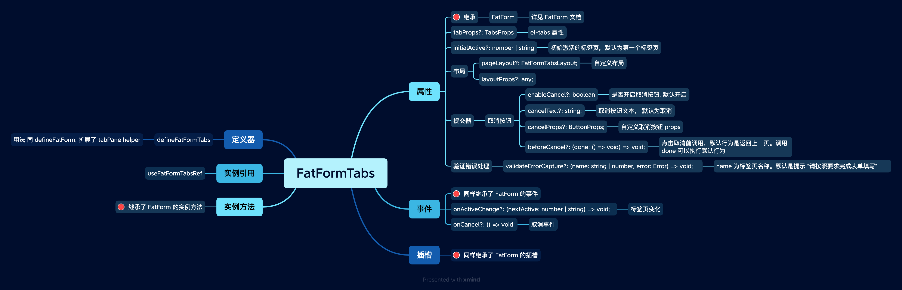

# FatFormTabs 标签页表单

`FatFormTabs` 是 FatForm 针对复杂标签页表单场景设计的一个组件

## 示例

使用组件模式创建:

<iframe class="demo-frame" style="height: 380px" src="./tabs.demo.html" />

::: details 查看代码

<<< @/fat-form-layout/Tabs.vue

:::

 
 
 
 

(推荐)使用 `defineFatFormTabs` 模式创建：

::: details 查看代码

<<< @/fat-form-layout/Tabs.tsx

:::

 
 
 

## API

`FatFormTabs`:

 
 
 

`FatFormTabPane`:

 
 
 
 
