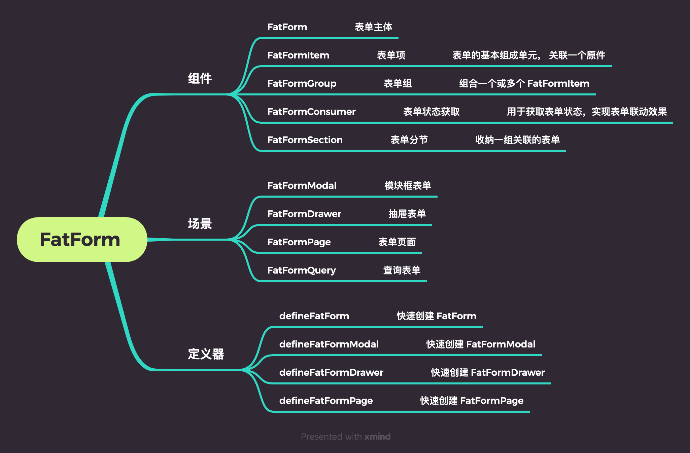
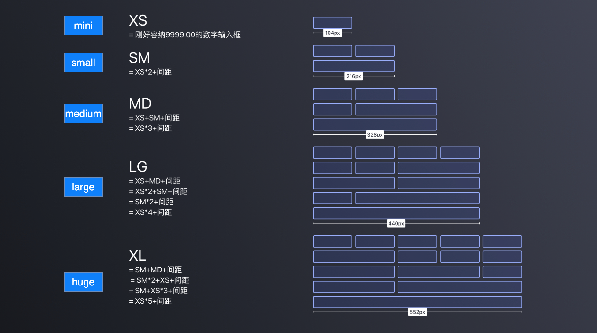

# 表单

FatForm 在 el-form 的基础之上进行了增强，配合原件，我们只需少量的配置就可以完成表单的开发。

以下是 FatForm 相关的套件：

 
 
 

[[toc]]

 
 
 

## 1. 表单布局

FatForm 支持 3 种典型的布局：

<ClientOnly>

<Layout />

</ClientOnly>

::: details 查看代码
<<< @/fat-form/Layout.vue
:::

 
 

### 1.1 分组

使用 `FatFormGroup` 可以对灵活地组合表单项， 让布局更加简单。

 
 

**水平组合**:

<ClientOnly>
  
<HozGroup />

</ClientOnly>

::: details 查看代码
<<< @/fat-form/HozGroup.vue
:::

 
 

**垂直组合**:

<ClientOnly>
  
<VerGroup />

</ClientOnly>

::: details 查看代码
<<< @/fat-form/VerGroup.vue
:::

 
 

**混编**:

<ClientOnly>
  
<MixGroup />

</ClientOnly>

::: details 查看代码
<<< @/fat-form/MixGroup.vue
:::

 
 
 

### 1.2 预定义宽度

我们预定义了一些表单项宽度，可以满足大多数表单场景，实现快捷开发的同时，保证 UI 的一致性：

 

 
 

- `mini`=104px 适用于短数字、短文本或选项。
- `small`=216px 适用于较短字段录入、如姓名、电话、ID 等。
- `medium`=328px 标准宽度，适用于大部分字段长度。
- `large`=440px 适用于较长字段录入，如长网址、标签组、文件路径等。
- `huge`=552px 适用于长文本录入，如长链接、描述、备注等，通常搭配自适应多行输入框或定高文本域使用。

 

示例：

<ClientOnly>
  

    <Width />
  

</ClientOnly>

::: details 查看代码
<<< @/fat-form/Width.vue
:::

 
 
 

### 1.3 网格布局

大部分场景我们推荐使用 FatFormGroup + width 来进行布局。 当然传统的网格布局我们依旧支持

<ClientOnly>
  

    <Grid />
  

</ClientOnly>

::: details 查看代码
<<< @/fat-form/Grid.vue
:::

 

`FatFormGroup` 在这里的作用就是充当 [Row](https://element-plus.gitee.io/zh-CN/component/layout.html#row-%E5%B1%9E%E6%80%A7), 如果要进一步控制 row 的行为，可以通过 `FatFormGroup`#row 属性进行配置。

 

`FatFormGroup`、`FatFormItem` 都可以作为网格的单元格，通过 `col` 来配置单元格。

 

::: tip
`FatFormGroup` 会自动检测子节点是否开启了网格，默认情况使用 FatSpace 来分组布局。
:::

 
 
 
 

### 1.4 固定网格

某些场景，我们可能想要让所有的字段统一使用一个单元格配置，比如查询表单。这种情况可以使用 `FatForm` 的 col 属性来配置：

 

<ClientOnly>
  

    <UniGrid />
  

</ClientOnly>

::: details 查看代码
<<< @/fat-form/UniGrid.vue
:::

 
 
 

### 1.5 提示信息

FatForm 内置了提示信息

 

<ClientOnly>
  

    <Message />
  

</ClientOnly>

::: details 查看代码
<<< @/fat-form/Message.vue
:::

 
 
 
 

### 1.6 分类

复杂的表单会包含很多字段，适当分类用户体验会更加好:

 

<ClientOnly>
  

    <Section />
  

</ClientOnly>

::: details 查看代码
<<< @/fat-form/Section.vue
:::

 
 

## 2. 预览模式
