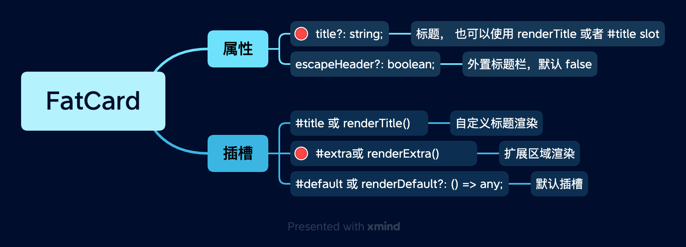

# FatCard 卡片

用于容纳一些页面片段, 比如表单、图表， 页面详情等等。

 
 
 

## 示例

**简单示例:**

<ClientOnly>
  
<CardGrid />

</ClientOnly>

::: details 查看代码
<<< @/fat-layout/CardGrid.vue
:::

 
 
 

**标题外置:**

<ClientOnly>
  
<CardGridEscaped />

</ClientOnly>

::: details 查看代码
<<< @/fat-layout/CardGridEscaped.vue
:::

 
 
 

**额外内容:**

<ClientOnly>
  
<CardExtra />

</ClientOnly>

::: details 查看代码
<<< @/fat-layout/CardExtra.vue
:::

 
 
 

**无标题模式:**

<ClientOnly>
  
<CardHeaderless />

</ClientOnly>

::: details 查看代码
<<< @/fat-layout/CardHeaderless.vue
:::

 
 
 
 

## API

 
 
 
