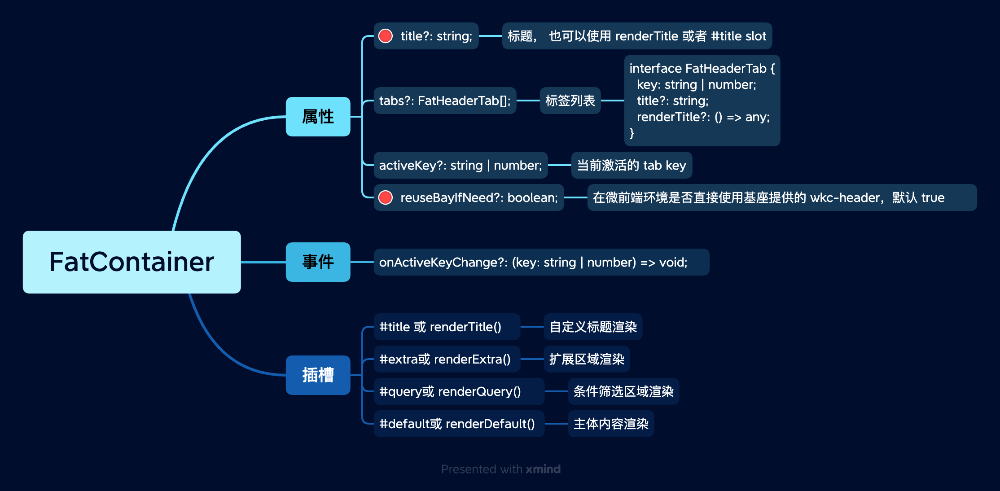

# FatContainer 容器

典型惟客云页面容器。

 
 
 

## 示例

**简单内容:**

<ClientOnly>
  
<ContainerSimple />

</ClientOnly>

::: details 查看代码
<<< @/fat-layout/ContainerSimple.vue
:::

 
 
 
 

**带筛选:**

<ClientOnly>
  
<ContainerWithQuery />

</ClientOnly>

::: details 查看代码
<<< @/fat-layout/ContainerWithQuery.vue
:::

 
 
 

**Tab 形式:**

<ClientOnly>
  
<ContainerTab />

</ClientOnly>

::: details 查看代码
<<< @/fat-layout/ContainerTab.vue
:::

 
 
 
 

## API

 

 
 
 
