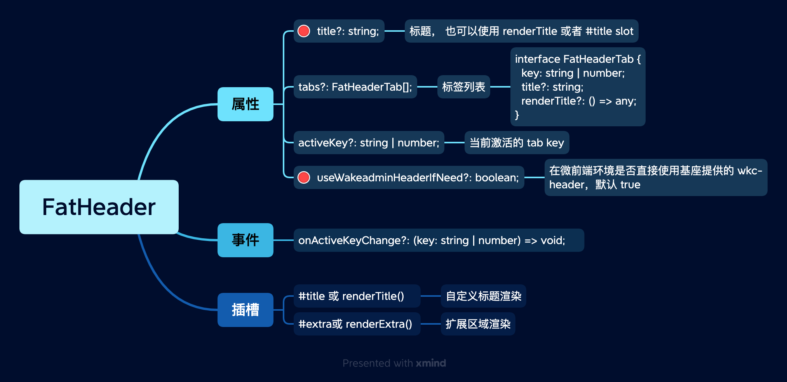

# FatHeader 首部

典型惟客云页面首部。

 
 
 

## 简单示例

<ClientOnly>
  
<HeaderSimple />

</ClientOnly>

::: details 查看代码
<<< @/fat-layout/HeaderSimple.vue
:::

 
 
 

## Tab 形式

<ClientOnly>
  
<HeaderTab />

</ClientOnly>

::: details 查看代码
<<< @/fat-layout/HeaderTab.vue
:::

 
 
 
 

## API

 

 
 
 
