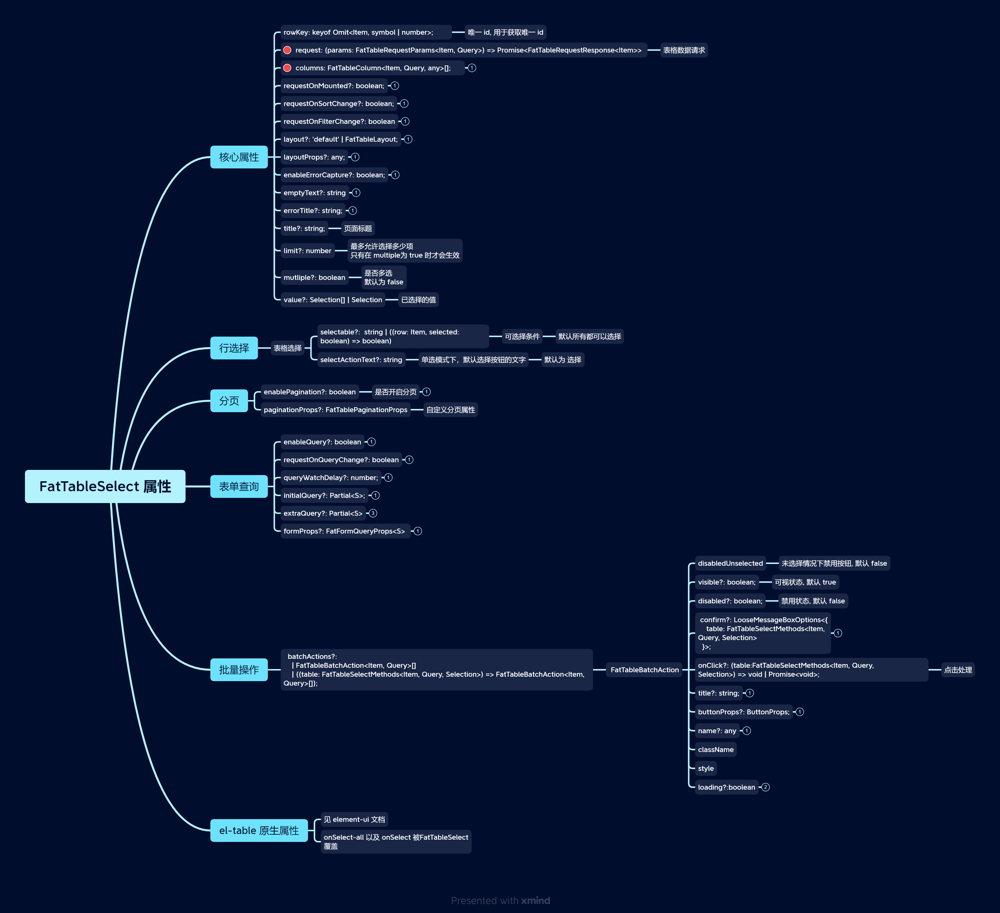
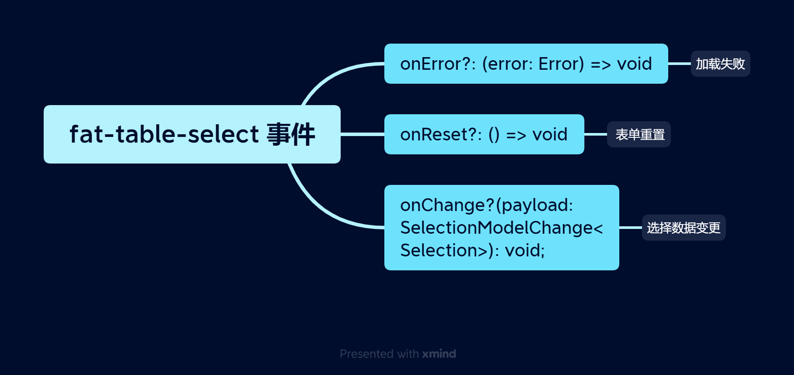
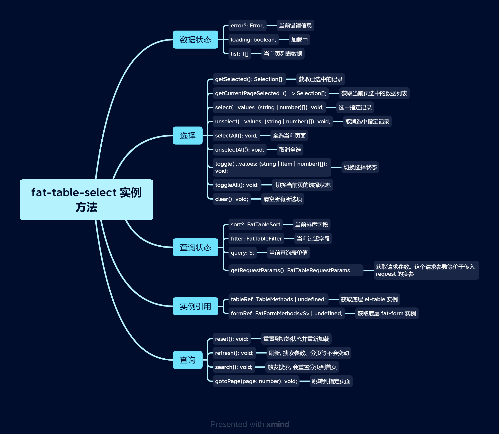

# FatTableSelect

`FatTableSelect` 是一个基于 `FatTable` 扩展的一个`Select Table`; 在使用上也基本类似，`FatTable`上能使用的基本上都可以在`FatTableSelect`上使用

<br>

[[toc]]

<br>
<br>
<br>

## 1. 快速创建一个页面

<br>
<br>

<iframe class="demo-frame" style="height: 800px" src="./quick-table-select.demo.html" />

::: details 查看代码

<<< @/fat-table-layout/QuickTableSelect.tsx

:::

<br>

可以发现，在点击了选择之后，无论是点击搜索还是重置，我们的选择值都不会发生变化，这非常符合表格选择的逻辑，即选中的值跟当前表格所展示的数据并没有什么太多的关联
<br>
<br>
<br>

## 2. defineFatTableSelect（推荐）

我们推荐使用 `defineFatTableSelect` + `TSX` 来快速定义一个表格组件，使用 `defineFatTableSelect` 可以获取到更好的智能提示和类型检查。

<br>
<br>

`defineFatTableSelect` 大致用法如下：

```tsx
interface Item {
  // 列表项类型声明
}

interface Query {
  // 表单查询类型声明
}
interface Selection {
  // 已选择项类型声明
}

export const MySelectTable = defineFatTableSelect<Item, Item, Selection>(({ table, column }) => {
  // 和 vue 的 setup 方法一样, 这里可以放置 Vue Composition API
  const someRef = ref(0);
  const someMethod = () => {};

  // 返回 FatTableSelect props
  return () => ({
    // 列表请求
    async request(params) {
      // ...
    },
    // 列定义
    columns: [
      // ...
    ],
    // 是否多选
    multiple: true,
    // 已选择的值
    value: [
      { name: '沙溪急', id: 229 },
      { name: '霜溪冷', id: 170 },
      { name: '月溪明', id: 155 },
    ],
    // ... 其他 FatTableSelect props
  });
});
```

`defineFatTableSelect` 类似于 `defineFatTable`。
<br>

当然也可以用 `template` 来写, 会丢失上下文信息(vue 组件不支持[`泛型`](https://www.typescriptlang.org/docs/handbook/2/generics.html#handbook-content))。
其用法与`fatTable`基本一致，除此之外，因为`FatTableSelect`是表单项，因此也支持`v-model`语法。

<br>
<br>
<br>

## 3. 操作

默认情况下，`FatTableSelect`会有一些预定义场景:

1. 如果`multiple`为`true`的话，那么会自动开启`enableSelect`，并且会插入一个默认的`BottomToolbar`；
2. 如果`multiple`为`false`的话, 如果用户没有传入`action`列的话，那么会自动插入一条默认的`action`列;当然，我们也可以传入自定义的`action`来处理我们的操作逻辑。

::: warning
`FatTableSelect`会忽略用户传入的`enableSelect`。

即`enableSelect`跟`multiple`是强绑定的。
:::

<br>

<iframe class="demo-frame" style="height: 730px" src="./table-select-actions.demo.html" />

::: details 查看代码

<<< @/fat-table-layout/TableSelectActions.tsx

:::

<br>
<br>
<br>

除此之外，我们也挺支持全选、反选。不仅如此，还可以传入一个`selectable`来处理该项是否允许选择。在多选情况下，我们也支持传入`limit`来限制用户的选择个数。

<iframe class="demo-frame" style="height: 800px" src="./table-select-all-actions.demo.html" />

::: details 查看代码

<<< @/fat-table-layout/TableSelectAllActions.tsx

:::

::: warning
暴露出来的`selectAll`、`unSelectAll`、`toggleAll`都是针对于当前页面的数据，并且如果页面里的某条数据不允许操作，那么也不会对其进行处理。

但是`select`、`unSelect`这两个方法则没有过多的额外操作，传入什么就处理什么，不会关注于该条数据是否在当前页面里、是否禁用等
:::
<br>

<br>
<br>
<br>

## 4. V-Model

`FatTableSelect`的返回值跟传入的`value`值相关。对于传入的`value`值，我们约定其数据格式类型为`Selection`。`Selection`的定义如下

- 基础数据类型， 即 `string` 或者为`number`。 该模式下，`FatTableSelect`会直接返回对应的`rowKey`的值

- `Object`，且该`Object`必须为`Item`的子集。 该模式下， `FatTableSelect`会按照传入的数据格式返回对应的值

- `undefined`，该模式下，会直接返回整个`item`对象

<iframe class="demo-frame" style="height: 800px" src="./table-select-model.demo.html" />

::: details 查看代码

<<< @/fat-table-layout/TableSelectModel.vue

:::

<br>

可以打开控制台查看其具体的输出

<br>
<br>
<br>

## 5. 自定义布局

FatTableSelect 默认布局使用的是 [FatContainer](../fat-layout/container.md)， 你也可以按照自己的需求实现自定义的布局。

## 6. 与`FatTable`的区别

1. 本质上 `FatTableSelect` 属于表单项， 与 `Select` 类似

2. 以下`props`将由`FatTableSelect`控制，不允许用户自定义

   - `enableSelect`
   - `selectable`
   - `onSelect`
   - `onLoad`

3. 不支持以下几个`FatTable`的`props`

- `enableCacheQuery`
- `onQueryCacheRestore`
- `confirmBeforeRemove`
- `messageOnRemoved`
- `messageOnRemoveFailed`
- `remove`
- `requestOnRemoved`
- `confirmBeforeRemove`
- `onSelect-all`

4. 默认情况下 会对`FatTableColumns`做一些处理

   - 如果`multiple`为`true`的话，那么会自动开启`enableSelect`，并且会插入一个默认的`BottomToolbar`；

   - 如果`multiple`为`false`的话, 如果用户没有传入`action`列的话，那么会自动插入一条默认的`action`列;当然，我们也可以传入自定义的`action`来处理我们的操作逻辑。

5. 提供了一系列操作`API`
6. 对外暴露的对象中里没有以下属性

- `selected`

## 7. API

### 7.1 FatTableSelect 属性



<br>
<br>
<br>
<br>

### 7.2 FatTableSelect 事件



<br>
<br>
<br>

### 7.3 FatTableSelect 实例方法



<br>
<br>
<br>

`FatTableSelect` 实例方式获取有两种方式：

1. `defineFatTableSelect` 函数参数 table 属性中获取：

   ```ts
   defineFatTableSelect(({ tableSelect }) => {});
   ```

  <br>

2. `<template>` 中，使用 `useFatTableSelectRef`:

   ```vue
   <template>
     <FatTableSelect ref="tableRef">...</FatTableSelect>
   </template>

   <script setup lang="tsx">
     import { FatTableSelect, useFatTableSelectRef } from '@wakeadmin/components';

     const tableRef = useFatTableSelectRef();
   </script>
   ```

<br>
<br>
<br>

### 7.4 FatTableSelect 插槽

跟`FatTable`一致

<br>
<br>
<br>

### 7.5 列定义

跟`FatTable`一致

<br>
<br>
<br>
