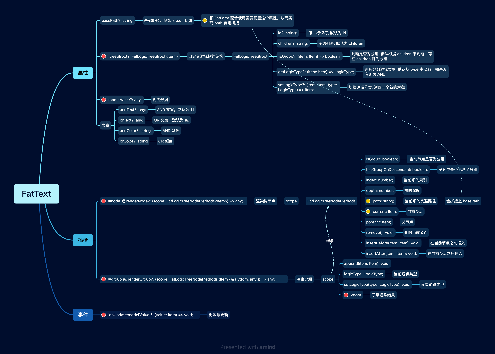

# FatLogicTree 逻辑树 (试验)

逻辑树

 

逻辑树是一个树形容器，可以用来表示一些逻辑关系。

基本概念：

- 节点：树形结构中的一个节点。 对应到逻辑语句中， 比如 `1`、 `1+1`、 `a + 1 > 2`，这些表达式都属于节点
- 分组：将多个节点组合起来，约束一些逻辑关系。 比如 `(a > 1) && (b < 0)` 就是一个分组，分组包含 `(a > 1)` 和 `(b < 0)` 两个节点
- 逻辑关系: 当前仅支持 AND、OR 两种关系。当然这个概念是可以互换的，比如 `并行` 和 `互斥`

因此逻辑树和普通数在结构上是有一些约束的:

- 节点只能放在分组中
- 节点不能作为分组的上级
- 分组可以包含分组

 
 
 

## 示例

### 自定义树结构

FatLogicTree 本身并不耦合约束树的结构，可以声明树的结构、逻辑的标识等等

<iframe class="demo-frame" style="height: 600px" src="./logic-tree-custom.demo.html" />

::: details 查看代码
<<< @/other/LogicTreeCustom.vue
:::

### 节点操作

 
 

<iframe class="demo-frame" style="height: 600px" src="./logic-tree-operation.demo.html" />

::: details 查看代码
<<< @/other/LogicTreeOperation.tsx

<<< @/other/LogicTreeOperation.module.scss
:::

 
 
 

### 和 FatForm 配合使用

<iframe class="demo-frame" style="height: 600px" src="./logic-tree-with-fat-form.demo.html" />

::: details 查看代码
<<< @/other/LogicTreeWithFatForm.tsx
:::

 
 
 
 

### 多层嵌套

 
 

<iframe class="demo-frame" style="height: 600px" src="./logic-tree-deep.demo.html" />

::: details 查看代码
<<< @/other/LogicTreeDeep.vue
:::

 
 
 
 

### 可拖拽

配合 sortablejs 实现

<iframe class="demo-frame" style="height: 600px" src="./logic-tree-with-sortable.demo.html" />

## API

