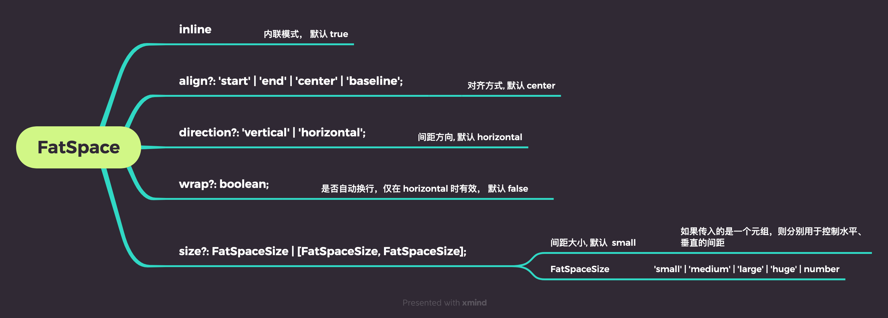

# FatSpace 间距

设置组件之间的间距

 
 
 

## 示例

水平:

<ClientOnly>
  
<SpaceHoz />

</ClientOnly>

::: details 查看代码
<<< @/other/SpaceHoz.vue
:::

 
 

垂直:

<ClientOnly>
  
<SpaceVer />

</ClientOnly>

::: details 查看代码
<<< @/other/SpaceVer.vue
:::

 
 
 
 

# API

