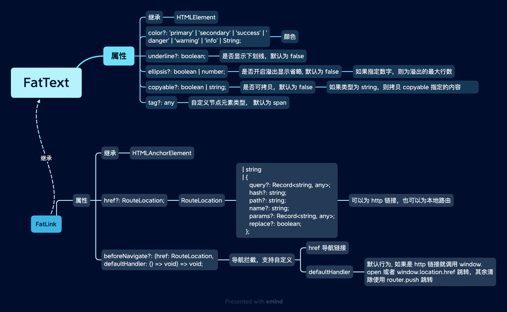

# FatText 文本

FatText 用于对文本进行一些简单的装饰、操作。

<script setup>
  import {FatText, FatLink} from '@wakeadmin/components'

</script>

## 示例

<ClientOnly>
<div class="wk-demo">
  <h5>下划线</h5>

  <FatText underline>
那些寂寞的花朵
是春天遗失的嘴唇
——《我，以及其他的证人》
  </FatText>

  <br>
  <br>

  <h5>颜色</h5>

  <FatText color="primary">
还有一些我们熟悉的将要死去
我们不熟悉的慢慢生根
——《黑风》
  </FatText>

  <br>
  <br>

  <h5>多行省略</h5>

  <FatText tag="p" style="width: 150px" :ellipsis="3">
离开妻子我<br>
自己是一只<br>
装满淡水的口袋<br>
在陆地上行走<br>
——《妻子和鱼》
</FatText>

<br>
<br>

<h5>可拷贝</h5>

<FatText copyable>
一切不幸都源于，我幽深的水
——《夜月》
</FatText>

<br>
<br>

<h5>链接</h5>

<FatLink href="https://zh.m.wikipedia.org/zh-hans/%E8%8B%8F%E8%81%94%E6%94%BF%E6%B2%BB%E7%AC%91%E8%AF%9D" target="_blank" copyable>苏联笑话合集</FatLink>

</div>

</ClientOnly>

::: details 查看代码

```vue
<template>
  <h5>下划线</h5>

  <FatText underline> 那些寂寞的花朵 是春天遗失的嘴唇 ——《我，以及其他的证人》 </FatText>

  <br />
  <br />

  <h5>颜色</h5>

  <FatText color="primary"> 还有一些我们熟悉的将要死去 我们不熟悉的慢慢生根 ——《黑风》 </FatText>

  <br />
  <br />

  <h5>多行省略</h5>

  <FatText tag="p" style="width: 150px" :ellipsis="3">
    离开妻子我<br />
    自己是一只<br />
    装满淡水的口袋<br />
    在陆地上行走<br />
    ——《妻子和鱼》
  </FatText>

  <br />
  <br />

  <h5>可拷贝</h5>

  <FatText copyable> 一切不幸都源于，我幽深的水 ——《夜月》 </FatText>

  <br />
  <br />

  <h5>链接</h5>

  <FatLink
    href="https://zh.m.wikipedia.org/zh-hans/%E8%8B%8F%E8%81%94%E6%94%BF%E6%B2%BB%E7%AC%91%E8%AF%9D"
    target="_blank"
    copyable
    >苏联笑话合集</FatLink
  >
</template>

<script setup>
  import { FatText, FatLink } from '@wakeadmin/components';
</script>
```

:::

<br>
<br>
<br>
<br>

## API


